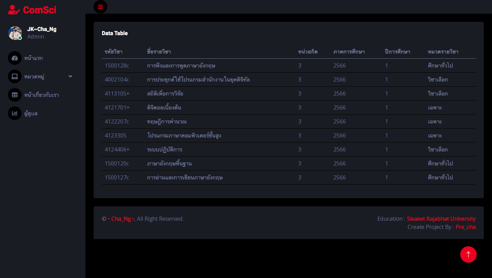
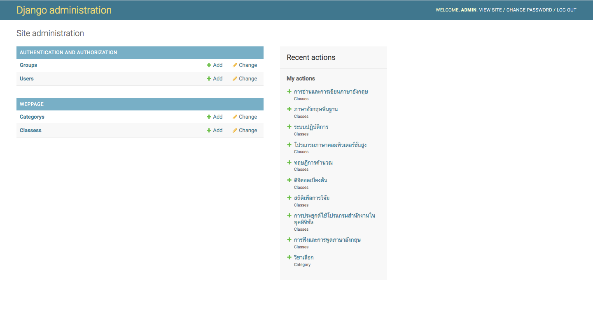
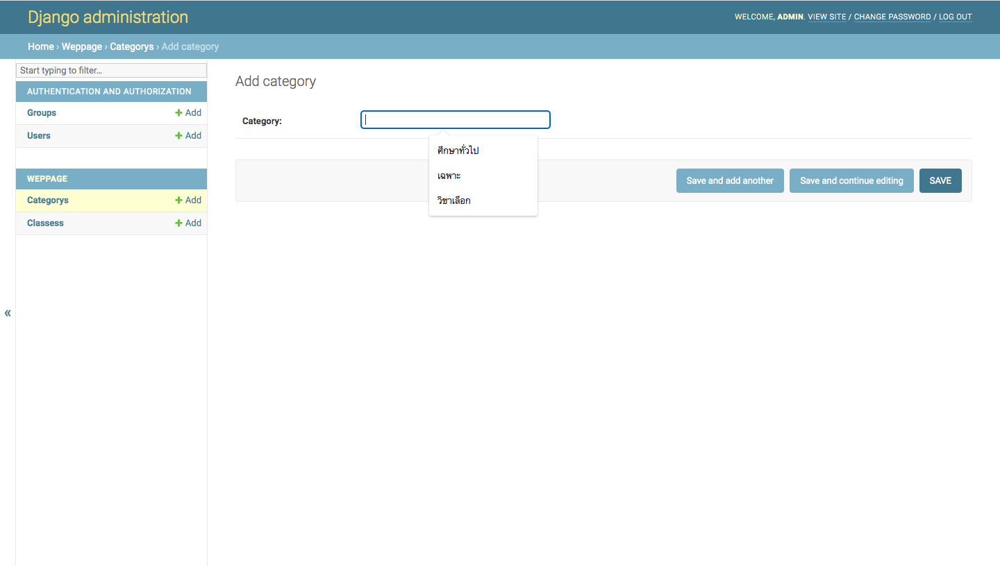
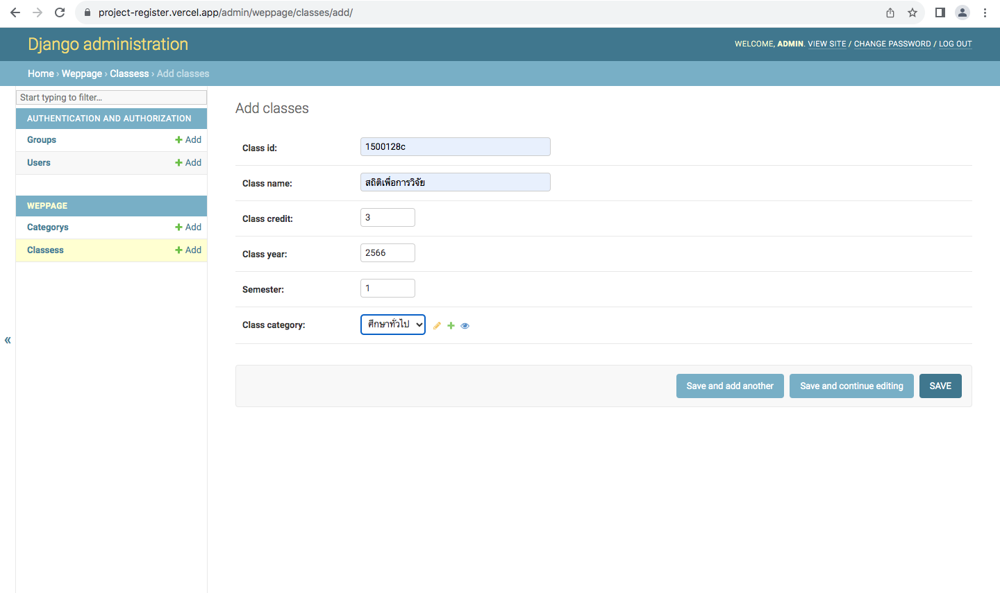
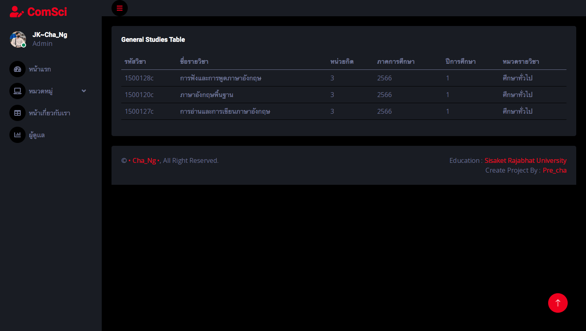
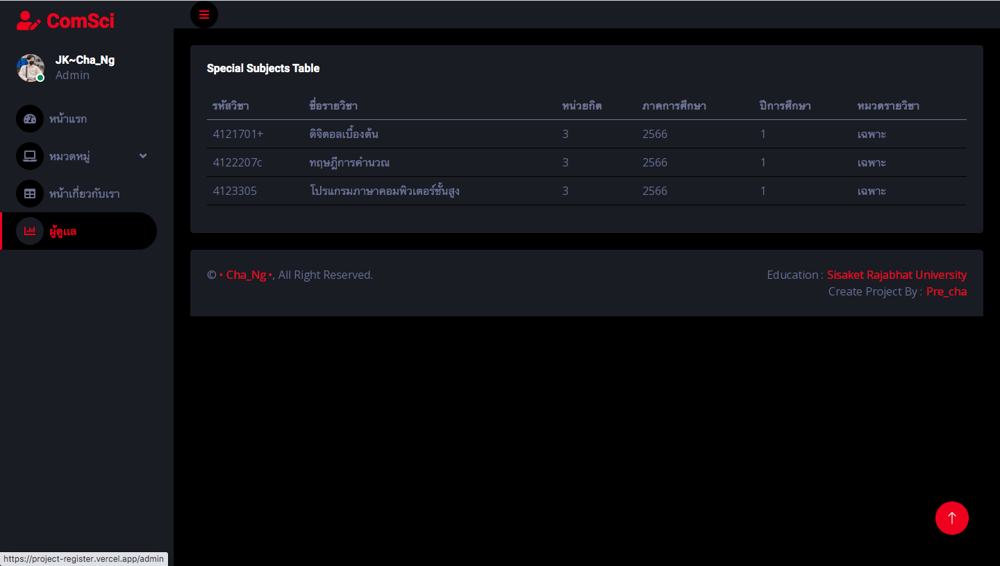
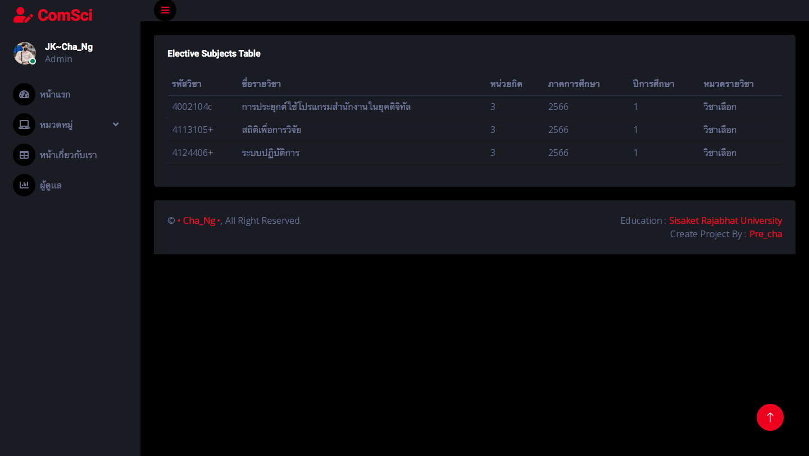
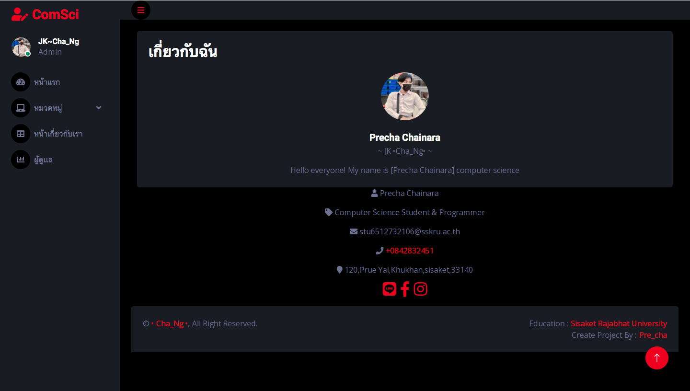

# Project_Register
   
##  ความสามารถของระบบในภาพรวม
   - แสดงรายชื่อวิชาทั้งหมดได้
   - แสดงรายชื่อวิชาตามหมวดหมู่รายวิชา

 

##  เว็บแอพพลิเคชั่นสําหรับบันทึก และแสดงผลรายชื่อวิชาที่ที่เปิดให้ลงทะเบียน
 -  หน้า admin

     
     

 -  หน้า Add category

     

 -  หน้า Add classes

     

## หน้าเว็บที่จําเป็นต้องมีคือ
   - หน้าแรก แสดงรายวิชาทั้งหมด
   - หน้าหมวดหมู่
   - หน้าเกี่ยวกับเรา
   - หน้าผู้ดูแลระบบ

 

 

 

 

 

 

## Front end
- Bootstrap 5
- HTML 5
- CSS 3
## Deployment
- Vercel
## Database
- PosgestSQL (supabase)
## Back end
- Django Framework
## Template
 https://themewagon.com/themes/free-bootstrap-5-admin-dashboard-template-darkpan/

 By Dek Comsci 65

 @ Precha Chainara